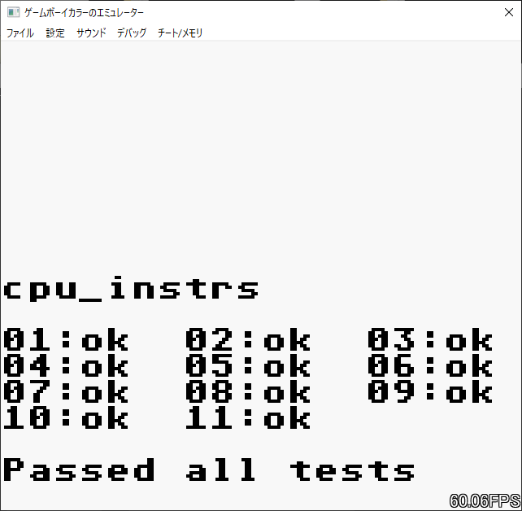
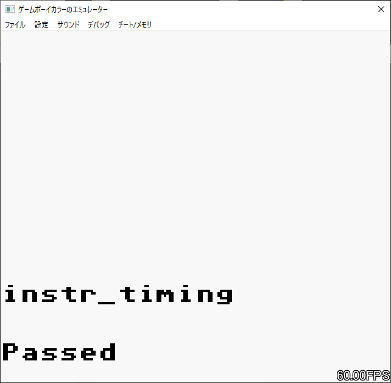

# GameBoyColor_Emulator
GameBoyColor Emulator
  
ゲームボーイカラーのエミュレーターです  
ゲームボーイ(白黒)にも対応しています  
ROM ONLY, MBC1, MBC2, MBC3(RTCは未実装), MBC5 に対応しています  
サウンドを実装しています(各チャンネルごとにミュート可能)  
チート/メモリサーチ機能を実装しています  
動作しないソフトは多分あります  
 
# 実行可能ファイルについて
著作権の関係上実行可能ファイルはゲームボーイとゲームボーイカラーのbootromのバイナリファイルをどこかしらで手に入れてそれぞれbootrom_256byte.binとbootrom_cgb.bin にリネーム後  
"bootrom/bootrom_256byte.bin" "bootrom/bootrom_cgb.bin" となるように配置してから自分でビルドしてください  
ビルドしてできた実行可能ファイルをExecutableディレクトリに入れると実行できます  
 
# スクリーンショット
 
 
 
 
 
 
